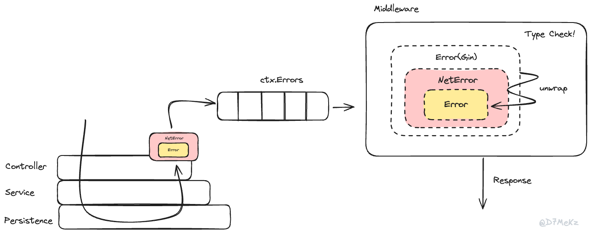

이전에는 Gin이 어떻게 예외 처리를 하는지 언급했다. 이제부터 직접 구현하고자 한다.

## Error Wrapping

직접 제작한 에러 코드인 WebCode와 에러를 감싼 `NetError`를 만들었다.

```go
type NetError struct {
	Code codes.WebCode
	Err  error
}
```

프로젝트 구현할때 주로 gin 혹은 ent 라이브러리를 쓴다. 별도의 Error 구조체(NetError)를 정의함으로써 `Err`에 gin 혹은 ent 에러를 담겠다는 의미인 것이다.

## Gin에서의 예외 처리

[Gin Error() 함수](https://pkg.go.dev/github.com/gin-gonic/gin#Context.Error)에 의하면 Gin의 Context에 Error를 담은 후에 Middleware에서 처리하는 것을 권장하고 있다.

> Error attaches an error to the current context. The error is pushed to a list of errors. **It's a good idea to call Error for each error that occurred during the resolution of a request.** A middleware can be used to collect all the errors and push them to a database together, print a log, or append it in the HTTP response. Error will panic if err is nil.

라이브러리 코드를 보면 `Errors` 필드가 정의되어 있는데, errorMsg는 `[]*Error` 에러 리스트로 타입을 가지고 있다. 위의 설명대로 error의 리스트가 Context 내부에 구현되어 있는 것이다.

```go
// gin/context.go
type Context struct {
	// ...
   Errors errorMsgs
	// ..
}

// gin/errors.go
type errorMsgs []*Error
```

즉, ctx.Error를 활용하여 입력받은 에러를 Gin의 에러로 감싼 후에 Context의 Errors 리스트에 넣게 된다.

```go
// gin/context.go
// Error attaches an error to the current context. The error is pushed to a list of errors.// It's a good idea to call Error for each error that occurred during the resolution of a request.// A middleware can be used to collect all the errors and push them to a database together,
// print a log, or append it in the HTTP response.
// Error will panic if err is nil.
func (c *Context) Error(err error) *Error {
    if err == nil {
       panic("err is nil")
    }

    var parsedError *Error
    ok := errors.As(err, &parsedError)
    if !ok {
       parsedError = &Error{
          Err:  err,
          Type: ErrorTypePrivate,
       }
    }

    c.Errors = append(c.Errors, parsedError)
    return parsedError
}
```

Context 내부에 있는 Error 리스트는 Middleware에서 처리하게 된다.

Gin에서는 [HandlerFunc](https://pkg.go.dev/github.com/gin-gonic/gin#HandlerFunc)를 slice로 구현된 [HandlerChain](https://pkg.go.dev/github.com/gin-gonic/gin#HandlersChain)이 있는데, 이는 Gin이 각가지의 Handler를 Chain내에 넣고 처리하는 것이다.

```go
type HandlersChain []HandlerFunc
```

그럼 오류를 어떻게 발생시키면 될까? HandlerChain 내에 있는 대기 중인(Pending) Handler를 호출하지 않도록 하면된다. 즉, Context를 [Abort](https://pkg.go.dev/github.com/gin-gonic/gin#Context.Abort)하면 되는 것이다. 그 이후에 처리할 Handler가 없어지면서 종료가 된다.

> Abort prevents pending handlers from being called. Note that this will not stop the current handler. Let's say you have an authorization middleware that validates that the current request is authorized. If the authorization fails (ex: the password does not match), **call Abort to ensure the remaining handlers for this request are not called.**

## 프로젝트에 적용하기

### 절차

위의 내용을 가지고 실제로 적용해보자.
프로젝트 구성은 3계층으로 커스텀 에러 감싸기는 서비스 로직에 수행하도록 했다.

1. Service 계층에 Error Wrapping을 한다.
2. Controller에 context 내에 있는 에러 리스트에 예외를 넣는다.
3. Middleware에 Error Wrapping한 것을 Unwrapping 하면서 예외 타입을 학인한다.
4. 커스텀 에러라면 WebCode에 따른 응답값을 반환한다.

그림으로 표현하자면 아래와 같다.


### 코드

코드는 아래의 두 사이트를 참고했습니다.

- [Naver D2, Golang, 그대들은 어떻게 할 것인가 - 3. error 래핑](https://d2.naver.com/helloworld/2690202)
- [Naver D2, Golang, 그대들은 어떻게 할 것인가 - 4. error 핸들링](https://d2.naver.com/helloworld/6507662)

#### Service Layer

Persistence Layer에서 얻은 에러 값을 직접 받은 후에 Service 계층에서 적절하게 NetError로 감싼다.

```go
// service
func (s *MemberService) CreateMember(ctx *gin.Context, req data.RegisterReq) (*ent.Member, *errorutils.NetError) {
	// Check member Exist
	existedMem, err := s.Store.GetMemberByEmail(ctx, req.Email)
	if err != nil {
		return nil, &errorutils.NetError{Code: codes.MemberInternalServerError, Err: err}
	}
	if ent.IsNotFound(err) {
		mem, err2 := s.Store.Create(ctx, req)
		if err2 != nil {
			return nil, &errorutils.NetError{Code: codes.MemberCreationError, Err: err2}
		}
		return mem, nil
	}
	return existedMem, nil
}
```

#### Controller Layer

Controller는 Service 계층에서 감싼 커스텀 에러를 받은 후에 Context의 에러 리스트에 넣는다.

```go
func (controller *MemberController) RegisterMember(ctx *gin.Context) {
	req := data.RegisterReq{}
	err := ctx.ShouldBindJSON(&req)
	if err != nil {
		_ = ctx.Error(errorutils.NewNetError(codes.MemberInvalidJson, err))
		return
	}

	// Create member
	mem, err2 := controller.service.CreateMember(ctx, req)
	if err2 != nil {
		// Service 계층에서 받은 에러를 Context 내 에러 리스트에 넣는다.
		_ = ctx.Error(err2)
		return
	}

	mid := data.MemberId{MemberId: mem.ID}
	response.SuccessWith(ctx, codes.MemberCreationSuccess, mid)
}

```

#### Middleware

에러 응답값을 반환할 HandlerFunc를 구현한다.

1. [Next](https://pkg.go.dev/github.com/gin-gonic/gin#Context.Next)를 활용하여 대기 중인 핸들러를 실행시킨다.
2. [errors.As](https://pkg.go.dev/errors#example-As)를 활용하여 Context 에러 리스트에 있는 에러가 커스텀 에러인지 확인한다. 정확히 말하자면 에러를 unwrapping하면서 커스텀 에러인지 확인한 후에 있다면 `netError`에 넣게 된다.
3. WebCode를 활용하여 응답값을 얻은 후 [AbortWithStatusJson](https://pkg.go.dev/github.com/gin-gonic/gin#Context.AbortWithStatusJSON) 를 활용하여 Response json을 전송한다.

```go
func ErrorHandler() gin.HandlerFunc {
    return func(ctx *gin.Context) {
		// Pending 중인 핸들러 실행
       ctx.Next()
       // JSON이 두번 쓰이는 것을 대비해서 Body 확인
       isBodyWritten := ctx.Writer.Written()
       err := ctx.Errors.Last()

       if err != nil {
	       // 커스텀 에러인지 확인
          var netErr *errorutils.NetError
          if errors.As(err, &netErr) {
             code := netErr.GetCode()
             statusCode := codes.GetStatus(code)
             res := response.NewErrorResponse(code)

             if !isBodyWritten {
                ctx.AbortWithStatusJSON(int(statusCode), res)
             }
          } else {
             res := response.NewErrorResponse(codes.GlobalInternalServerError)
             if !isBodyWritten {
                ctx.AbortWithStatusJSON(http.StatusInternalServerError, res)
             }
          }

       }
    }
}
```

## 마무리

Go의 예외 매커니즘은 다른 언어와 달라서 틀을 잡는데 많은 시간을 사용했다. 공식 문서나 다른 사람들의 예제 코드를 분석하면서, Go 스러움이 무엇인지 자츰 배워간다는 느낌이다. 그러나 코드양이 많아지면서 오히려 코드가 복잡해지는 것 같기도 하다.
