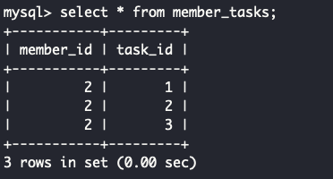

## ORM 선택

Go의 경우에는 JAVA와 달리 대표적인 ORM 프레임워크가 없어, 개발자가 직접 선택해서 사용해야 한다.

> 다양한 Go ORM 프레임워크 순위를 알고 싶다면 [OSS Insight](https://ossinsight.io/collections/golang-orm/) 를 참고하길 바란다.

기본적으로 mysql driver 사용을 생각했다. 그러나 정교한 저수준의 쿼리를 다루는 것이 아니기 때문에 ORM를 적극적으로 활용하고 싶었다.

### 조건

- 깔끔한 도메인 정의
- 여러 종류의 DB 지원
- 컴파일 레벨에서 디버깅 가능

## Ent

[Ent](https://entgo.io/docs/getting-started/)란 Facebook에서 개발한 Go ORM이다. 공식 설명에 의하면 그래프 구조의 데이터베이스 스키마를 가지고 있으며, 코드 생성을 기반으로 하는 정적 타이핑을 지원한다.[^1] 이는 위에서 말한 조건에 어느 정도 충족이 된다.

다만 ent는 관계형 데이터베이스에 적합하며 NoSQL 기반 데이터베이스에는 적합하지 않았다.[^2] ORM 선택 조건에는 부합하지 않았으나 대부분의 ORM이 RDB 위주로 지원한다는 것[^3]을 감안했을때 ent은 RDB 사용 시 괜찮은 선택이라고 생각한다.

초반에 Gorm 사용도 고려했다. 그러나 모델을 정의하는데 사용되는 `struct tag` 는 개인적으로 가독성이 좋지 않다는 인상이 들었다.

```go
type Model struct {
  ID        uint           `gorm:"primaryKey"`
  CreatedAt time.Time
  UpdatedAt time.Time
  DeletedAt gorm.DeletedAt `gorm:"index"`
}
```

## 첫인상

ORM 라이브러리의 schema를 본 순간 그래프 데이터베이스인 줄 알았다. 과거에 Neo4j[^4]라는 그래프 데이터베이스를 사용해본 적이 있는데, 이 노드, 그래프를 별도로 정의해서 구현한 점이 상당히 유사했기 때문이다.

```go

type Task struct {
    ent.Schema
}
// Fields of the Task.
func (Task) Fields() []ent.Field {
    return []ent.Field{
       field.Int("id"),
       field.String("title"),
       field.Int("total_status"),
       field.Time("created_at").Default(time.Now()),
       field.Time("modified_at").Default(time.Now()),
    }
}

// Edges of the Task.
func (Task) Edges() []ent.Edge {
    return []ent.Edge{
       edge.To("subtask", SubTask.Type),
    }
}
```

[공식 홈페이지](https://entgo.io/docs/getting-started/)를 참고해보면 Ent ORM에 대해 이렇게 설명했다.

> Easily model database schema as a graph structure.

schema 구조를 그래프 구조로 구현되어 있다는 것이다. 아마 ent가 그래프 탐색에 대한 자신감을 표현한 것도 구조적인 이유때문이지 않을까 싶다.

## 적용하기

### Schema

ent의 참조 방식은 독특하다. 기존의 참조 방식과 반대이기 때문이다.[^5]
ent 공식 문서에 의하면 edge.To를 사용하고 있으면 설정한 Edge를 소유한다고 정의한다.[^6]

> A schema that defines an edge using the `edge.To` builder owns the relation, unlike using the `edge.From` builder that gives only a back-reference for the relation (with a different name).

🤔 필자의 경우 위의 정의를 고려하고 구현하니 더 헷갈리기 시작했다. 그래서 관계 소유자인 schema만 정의하고, 그 외에는 서로의 연관관계를 설정해준다는 마음으로 구현했다.

Member : Task Entity가 1:N 연관 관계를 가진다고 가정해보자.


Member는 `tasks`라는 관계의 소유자이다. 그러므로 `edge.To`로 관계를 설정한다. 하지만 Task는 many에 해당되기 때문에 아무것도 설정하지 않는다.

```go
// Fields of the Member.
func (Member) Fields() []ent.Field {
    return []ent.Field{
       field.Int("id"),
       field.String("email"),
       field.String("username"),
       field.String("password"),
       field.Time("created_at").Default(time.Now()),
    }
}

// Edges of the Member.
func (Member) Edges() []ent.Edge {
    return []ent.Edge{
       edge.To("tasks", Task.Type),
    }
}
```

Task에서는 Member에서 소유한 관계(user)를 역참조해서 관계를 정의하게 된다. 이때 Member는 관계에서 One에 해당되니 `Unique() 함수`를 붙이게 된다.

```go
// Fields of the Task.
func (Task) Fields() []ent.Field {
    return []ent.Field{
       field.Int("id"),
       field.String("title"),
       field.Int("total_status"),
       field.Time("created_at").Default(time.Now()),
       field.Time("modified_at").Default(time.Now()),
    }
}

// Edges of the Task.
func (Task) Edges() []ent.Edge {
    return []ent.Edge{
       edge.From("member", Member.Type).Ref("tasks").Unique(),
    }
}
```

참조하는 이유는 어떤 schema와 참조하는지를 명시하기 위해서라고 보면 된다.

> ... because there can be multiple references from one schema to other.

### 예제 - 데이터 생성 코드

그럼 데이터를 생성할때 어떻게 해야할까? 참조하는 Schema(Task)에서 Member 정보를 추가해주면 된다.

공식 문서에서는 직접 Query해서 데이터를 가져왔지만[^7] , 그 외에도 Schema 데이터( 예제에서는 ent.Member) 혹은 아이디만으로도 추가가 가능하니 공식 문서를 참고하길 바란다.

```go
func (s *Store) Create(ctx *gin.Context, b request.CreateTask) error {
    // create Task
    _, err := s.client.Task.Create().SetTitle(b.Title).SetTotalStatus(0)
    .SetMemberID(b.UserId).Save(ctx)
    if err != nil {
       return err
    }
    return nil
}
```

실제로 데이터베이스를 보면 {참조하는 관계명} \_ {참조하는 관계명}으로 이뤄져 있다.


위의 예제에서는 1:N(One-to-Many)인 경우에면 설명했지만 (M:N)의 경우에는 {참조하는 관계명} \_ {참조하는 관계명}의 이름을 가진 테이블이 생성된다.



[^1]: https://entgo.io/docs/getting-started/
[^2]: 필자는 MongoDB에 적용시키고자 검색을 여러번 했지만 끝내 찾지 못했다.
[^3]: https://blog.billo.io/devposts/go_orm_recommandation/
[^4]: https://neo4j.com/docs/getting-started/
[^5]: https://umi0410.github.io/blog/golang/how-to-backend-in-go-db/
[^6]: https://entgo.io/docs/schema-edges#quick-summary
[^7]: https://entgo.io/docs/schema-edges#o2o-two-types
