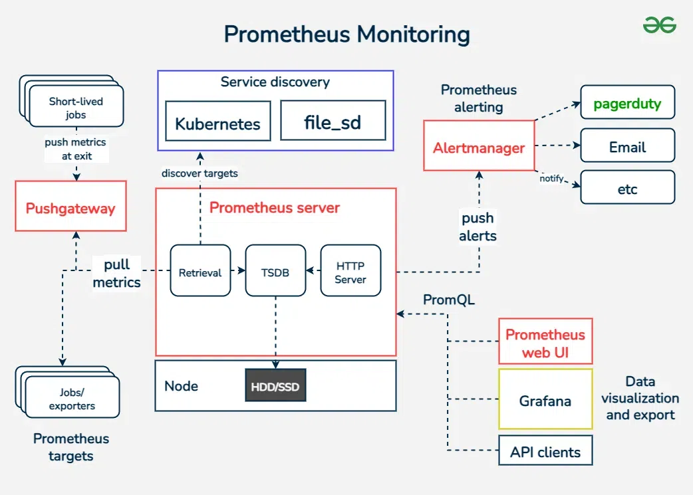
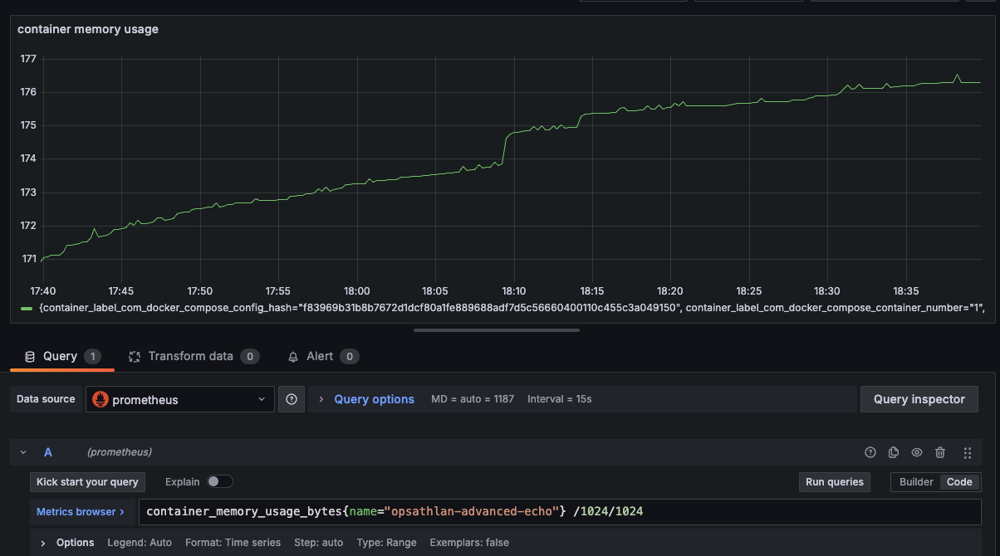

## 시나리오

[이전글](https://s0okju.github.io/p/opsathlan-1/) 을 보니 스프링 애플리케이션 컨테이너에 문제가 생긴 것 같다. spring boot 애플리케이션에 대한 지표를 수집할 수 있도록 환경을 구축해보자.

### 환경

- Ubuntu 22.04
- Openstack 2024.1

### 전체 구상도

아래와 같이 구상됩니다. cAdvisor를 설정한 이유는 컨테이너 관련 메트릭을 수집하기 위해 설정했습니다.
docker-compose를 통해 컨테이너를 배포했습니다.


> 쿠버네티스는 컨테이너들의 리소스 지표를 제공하기 위해 cAdvisor를 기본적으로 제공합니다.[^1]

### 절차

1. Terraform, Ansible를 활용한 환경 구성
2. 프로메테우스를 활용한 지표 수집
3. 그라파나 시각화

## 환경 구성

클라우드 리소스의 구성 자체는 [이전](https://s0okju.github.io/p/opsathlan-1/)과 변화하지 않았습니다.

### docker compose

다만 환경 구성은 변했습니다. 개별 컨테이너로 배포하는 것이 아닌 docker-compose를 통해 관련 컨테이너를 배포했습니다. 그 이유는 컨테이너의 개수가 많아짐에 따라 컨테이너를 큰 묶음으로 관리하기 위해서입니다.

총 4개의 컨테이너를 배포하게 됩니다

- Prometheus
- Grafana
- Springboot application
- cAdvisor

```yml
# docker-compose.yml

version: "3.7"

services:
  # Prometheus service
  prometheus:
    image: prom/prometheus:latest
    container_name: prometheus
    volumes:
      - ./prometheus/prometheus.yml:/etc/prometheus/prometheus.yml
    ports:
      - "9090:9090" # Expose Prometheus web UI
    networks:
      - monitoring

  # Grafana service
  grafana:
    image: grafana/grafana:latest
    container_name: grafana
    ports:
      - "3000:3000" # Expose Grafana web UI
    networks:
      - monitoring
    depends_on:
      - prometheus

  # Spring Boot app service
  advanced-echo:
    image: opsathlan-advanced-echo:latest
    container_name: opsathlan-advanced-echo
    ports:
      - "8080:8080"
    networks:
      - monitoring

  # cadvsior config
  cadvisor:
    container_name: cadvisor
    image: gcr.io/cadvisor/cadvisor:latest
    ports:
      - "8081:8080"
    volumes:
      - "/:/rootfs:ro"
      - "/var/run:/var/run:ro"
      - "/sys:/sys:ro"
      - "/var/lib/docker/:/var/lib/docker:ro" # docker container log
    networks:
      - monitoring

networks:
  monitoring:
    driver: bridge
```

### 프로메테우스

프로메테우스가 수집한 메트릭 지표는 springboot container 관련 지표와 컨테이너 관련 지표입니다. 그래서 `scrape_configs` target에 관련 컨테이너 URL를 기입하게 됩니다.

```yml
# prometheus.yml
global:
  scrape_interval: 10s # How often to scrape targets

scrape_configs:
  - job_name: "opsathlan-advanced-echo"
    static_configs:
      - targets: ["opsathlan-advanced-echo:8080", "cadvisor:8080"]
        labels:
          group: "test"
```

### docker compose를 실행하는 Ansible playbook

nova에서 docker-compose를 실행시키기 위해서는 **관련 바이너리를 설치**하고, **필요한 환경 파일을 인스턴스에 복사**하는 작업이 필요합니다. [docker-compose 라는 ansible role](https://github.com/S0okJu/OpsAthlan/tree/sc/2/scenario_02/ansible/docker-compose)를 만들어 스프링 컨테이너 이미지를 빌드하고, docker compose를 실행시키는 테스크를 추가했습니다.

개인적으로 작업한 [도커 설치 ansible-role](https://github.com/S0okJu/OpsAthlan/tree/sc/2/scenario_02/ansible/docker-installation) 를 확인해보면 docker 설치할때 `docker-compose plugin`를 설치하게 됩니다. 그래서 별도의 설치 없이 `docker compose` 명령어 만으로도 docker-compose 파일을 실행시킬 수 있게 됩니다.

```yml
- name: Update apt cache
  apt:
    update_cache: yes
- name: Install Docker Engine, CLI, containerd, and plugins
  apt:
    name:
      - docker-ce
      - docker-ce-cli
      - containerd.io
      - docker-buildx-plugin
      - docker-compose-plugin
    state: present
```

프로메테우스를 실행시키기 위해서는 config 파일을 nova 인스턴스에 직접 저장해야 하는 작업이 필요합니다. `docker-compose.yml` 를 다시 확인해보면 local volume이 `./prometheus/prometheus.yml` 로 되어 있습니다. 파일 경로는 nova 인스턴스의 파일 경로로 해당 파일 경로에 맞게 설정 파일(prometheus.yml)를 저장해야 합니다.

```yml
# docker-compose.yml

services:
  # Prometheus service
  prometheus:
    image: prom/prometheus:latest
    container_name: prometheus
    volumes:
      - ./prometheus/prometheus.yml:/etc/prometheus/prometheus.yml
    ports:
      - "9090:9090" # Expose Prometheus web UI
    networks:
      - monitoring
```

prometheus의 폴더를 만든 후에 복사하는 작업을 하면 파일이 저장됩니다.

```yml
- name: Create Prometheus configuration directory
  file:
    path: "/home/ubuntu/prometheus"
    state: directory
    owner: "ubuntu"
    group: "ubuntu"
    mode: "0755"

- name: Copy Prometheus config file
  copy:
    src: ./prometheus.yml
    dest: /home/ubuntu/prometheus/prometheus.yml
    owner: "ubuntu"
    group: "ubuntu"
    mode: "0644"
```

docker compose 명령어를 수행하면 docker-compose 파일에 정의된 컨테이너들을 실행시킬 수 있습니다.

```yml
- name: Copy docker-compose.yml to the target machine
  copy:
    src: ./docker-compose.yml
    dest: /home/ubuntu/docker-compose.yml # Destination on the target machine
    owner: "ubuntu"
    group: "ubuntu"
    mode: "0644"

- name: Run docker-compose up to start containers
  command: docker compose up -d
  args:
    chdir: /home/ubuntu/
  become: true
```

## 프로메테우스를 활용한 지표 수집

메트릭 수집, 시각화, 알림, 서비스 디스커버리 기능을 모두 제공하는 오픈 소스 모니터링 시스템입니다. Pull 방식으로 메트릭을 수집하고 시계열 데이터베이스에 저장하는 특징을 가지고 있습니다.



pull 방식은 프로메테우스가 필요한 메트릭 지표를 대상 서버로부터 가져온다는 것과 같은 말입니다. 그래서 대상이 되는 서버는 프로메테우스가 메트릭을 받아갈 수 있도록 endpoint를 열어둬야 합니다.

보통의 방식이라면 spring boot actuator를 활용하여 `/actuator/metrics` 엔드포인트를 여는 방법을 사용할 수 있습니다.

```properties
# application.properties

management.endpoints.web.exposure.include=prometheus,metrics
management.endpoint.prometheus.enabled=true
management.prometheus.metrics.export.enabled=true
```

위와 같은 방식을 사용하게 되면 EOF 오류가 발생해 프로메테우스가 정상적으로 지표를 가져올 수 없었습니다. 그래서 header를 `TEXT_PLAIN`으로 지정해주는 controller를 생성했습니다.

```java
import io.micrometer.prometheusmetrics.PrometheusMeterRegistry;

@RestController
@RequiredArgsConstructor
public class MetricsController {

    private final PrometheusMeterRegistry prometheusMeterRegistry;

    @GetMapping("/metrics")
    public ResponseEntity<String> metrics() {
        String scrape = prometheusMeterRegistry.scrape();

        HttpHeaders headers = new HttpHeaders();
        headers.setContentType(MediaType.TEXT_PLAIN);

        return new ResponseEntity<>(scrape, headers, HttpStatus.OK);
    }
}
```

> springboot actuator
> 스프링부트 애플리케이션 모니터링과 관리에 필요한 기능을 제공합니다.

9090 포트에 접속해 프로메테우스 web ui를 보면 스프링부트 애플리케이션과 cAdvisor 지표가 정상적으로 통신됨을 알 수 있습니다.


## 그라파나를 통한 시각화

### cAdvisor 지표 시각화

그라파나에서 container의 메모리 사용량을 확인해봅니다. 메모리 단위로 확인하기 위해 1024를 두번 나눴습니다.

> 관련 지표는 [cadvisor Github](https://github.com/google/cadvisor/blob/master/docs/storage/prometheus.md)를 참고하길 바랍니다.

```promql
container_memory_usage_bytes{name="instance_name"}/1024/1024
```

아래의 그래프를 보면 계속 상승하고 있는 그래프를 확인할 수 있습니다.



### 스프링 애플리케이션 관련 지표 시각화

저는 [GrafanaLabs에서 제공해주는 JVM 대시보드](https://grafana.com/grafana/dashboards/4701-jvm-micrometer/)를 사용했습니다. dashboard ip를 설정하면 다양한 그래프를 확인할 수 있습니다.

아래의 사진은 일부만 나타낸 것이며 이것 이외에도 다양한 지표가 있습니다.


## 다음글

지금까지 모니터링할 수 있는 환경을 구축했습니다. 다음편에는 시각화한 표를 분석해보는 시간을 가지도록 하겠습니다.

[^1]: https://themapisto.tistory.com/44
