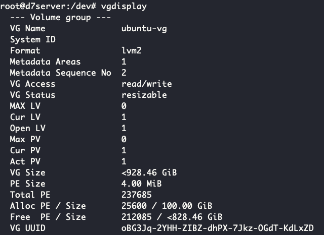
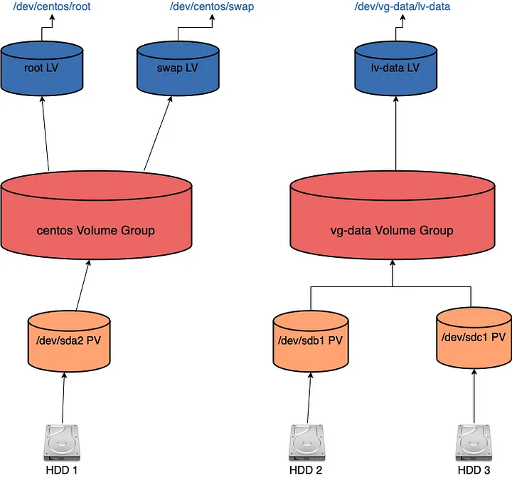

Multipass를 구동하려고 하는 중 디스크 용량이 꽉찼다는 메세지를 얻게 되었다.

```
cannot create temporary directory for the root file system: No space left on device
```

서버에서 사용중인 SSD는 1TB인데 5개의 Multipass 인스턴스로 다 찬다는 것은 말이 되지 않았다.


실제 하드웨어 상에서 부착된 용량과 ubuntu lvm에서 사용되는 최대 용량이 달랐다. 그러므로 이 용량을 적절하게 조절해야 한다.


## 해결

LV의 용량을 VG의 크기만큼 조절한다. [Stack Exchange](https://askubuntu.com/questions/1106795/ubuntu-server-18-04-lvm-out-of-space-with-improper-default-partitioning)에서 요구한대로 명령어를 사용하면 해결된다.

```bash
lvm
lvm> lvextend -l +100%FREE /dev/ubuntu-vg/ubuntu-lv
lvm> exit

resize2fs /dev/ubuntu-vg/ubuntu-lv
```

자세하게 봐보자. ubuntu-vg는 SSD의 용량만큼 적절하게 할당 받았다. 그러나 Alloc PE를 보면 100 GB 밖에 남지 않았다는 것을 알 수 있다.



`lvdisplay`로 lv를 확인해보면 ubuntu-lv가 100GB로 할당되었음을 확인할 수 있다.


여기서 LVM(Logical Volume Manager)의 개념을 알아야 하는데, 파일 시스템에 추상화 계층을 추가하여 논리적 스토리지를 생성할 수 있게 해준다.[^1]



저자의 환경에서는 Root LV가 100GB로만 할당되어 있어, 하드 디스크의 용량 만큼 사용할 수 없었던 것이었다.


현재 환경에서는 하나의 물리 디스크만 사용하기 때문에 설정하는데 복잡한 것은 없다. 그러므로 추가적으로 ubuntu-vg에 lv를 추가하지 않는 한 Root lv를 vg 크기만큼 사이즈를 키우면 된다.

[^1]: https://tech.cloud.nongshim.co.kr/2018/11/23/lvmlogical-volume-manager-1-%EA%B0%9C%EB%85%90/
