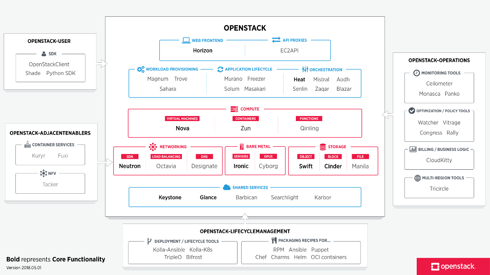
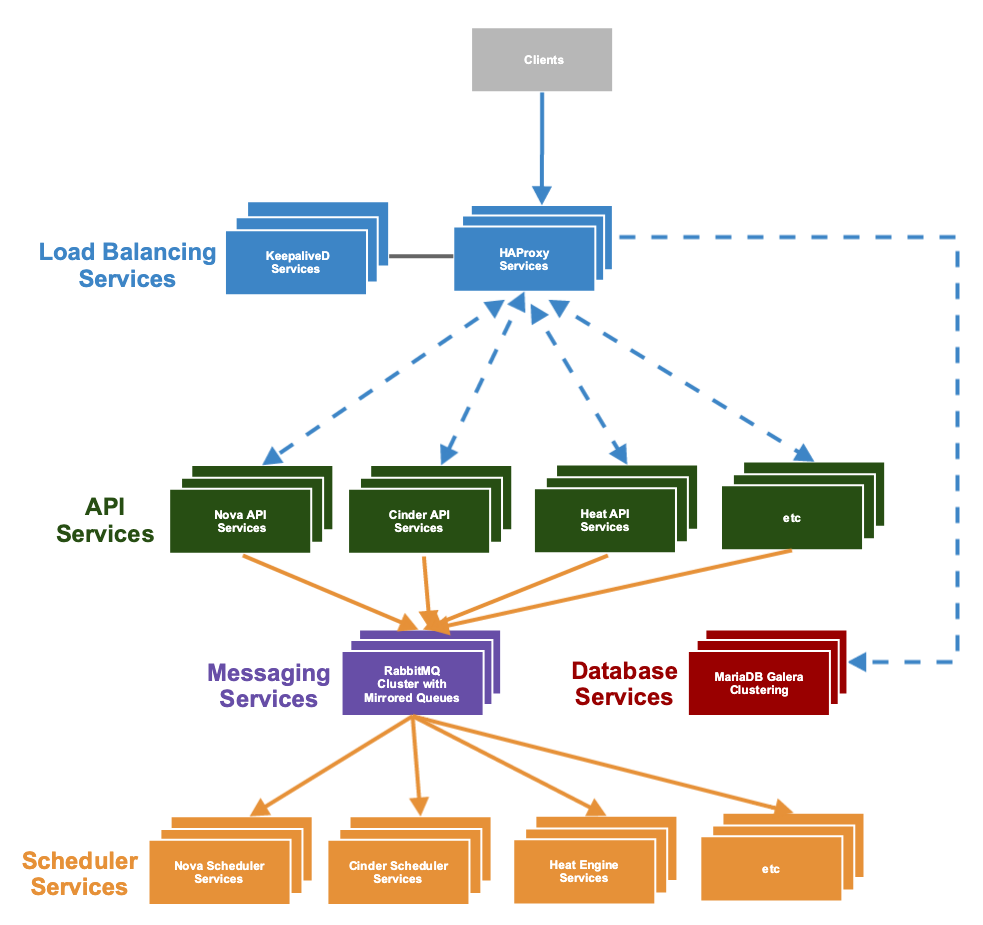
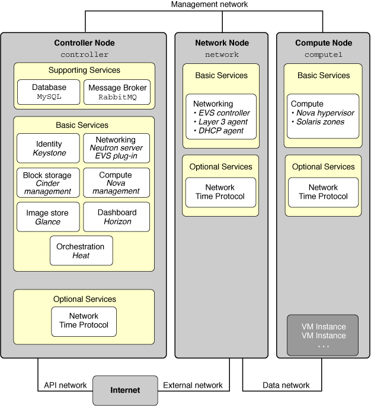
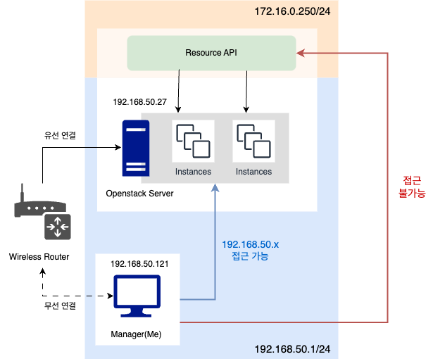

## DevStack의 한계

DevStack으로 Openstack을 배포하면서 큰 문제점을 느끼게 되었습니다.

- Nova Instance에 직접 접근하는 것이 어렵다.
- 리소스를 추가 및 삭제하는 것이 어렵다.

위의 문제점은 **네트워크로 인해 발생**한 것입니다.
예로 제가 Nova Instance를 생성해 Floating ip를 할당한다고 가정해 봅시다. External Network의 IP 범위가 외부와 연결이 불가능해 직접적으로 접근할 수 없게 됩니다. 그럼 ssh로 서버에 직접 접속해서 관리하는 방안도 있습니다. 그럼 Openstack을 왜 쓴거지? 키는 어떻게 관리하지? 등 다양한 꼬리 질문이 따라오게 됩니다.

## Kolla Ansible

방안을 모색하는 중 Openstack은 DevStack 이외에도 다양한 배포 방안이 있다는 것을 알게 되었습니다.



> Kolla Ansible이란 Ansible 플레이북을 통해 OpenStack의 모든 서비스를 **컨테이너로 배포**하고 유지 보수하며 운영할 수 있도록 도와주는 프로젝트이다. 이를 통해 복잡한 설치 과정과 수동 설정을 최소화하고, 재현 가능한 환경을 제공하여 효율적이며 안정적인 클라우드 인프라 운영을 가능하게 한다.[^1]

즉 우리가 설정한 시스템 서비스를 컨테이너 형태로 구축되는 것입니다.



## 설치

> 설치는 [파란돌님의 블로그 - Kolla-ansible로 Openstack All-in-one 설치하기(Installing Openstack All-in-one with Kolla-ansible)](https://parandol.tistory.com/72)를 적극 참고했습니다.

### 설치 목록

Kolla-ansible의 장점은 원하는 리소스 선택과 설정이 쉽다는 것입니다. 그래서 저는 기본적인 리소스를 선택하여 설치했습니다.

**설치할 리소스**

- Keystone
- Glance
- Nova
- Neutron
- Cinder
- Swift
- Horizon

### all-in-one or node?

오픈스택은 크게 3가지 노드가 있습니다.

- Controller node : 전체 오픈스택 서비스를 관리하기 위해 사용됩니다. 컨트롤러 관리 및 노드 간 연결을 의해서는 최소한 2개 이상의 인터넷 인터페이스가 필요합니다.
- Compute node : Nova 기반의 인스턴스를 작동하기 위해 사용되는 하이퍼바이저를 실행하는 노드입니다.
- Network node : 다양한 네트워크 서비스 에이전트를 실행하며, 이를 가상 네트워크에 인스턴스를 연결합니다.



여러 가이드를 보면 노드들은 물리적으로 분리되어 있습니다. 서버 내 가상머신을 구축하여 구현하는 방법이 있습니다. 그러나 복잡한 관계로 **서비스 기능을 하나의 호스트에 설치할 수 있는 all-in-one**[^2]을 선택하게 되었습니다.

## Openstack 네트워크

**가장 어렵고 앞으로 계속 공부해야 하는 분야**인 것 같습니다. 완전히 이해한 것은 아니지만 알고 있는 그대로 작성하겠습니다.

오픈 스택에서 네트워크는 Management, Tunnel, External 네트워크가 있습니다.

- Management Network : 관리용 네트워크로 각 컴포넌트와 관련된 API를 호출하는데 사용됩니다.
- Tunnel Network : vm instance 간 네트워크를 구축하는데 사용됩니다.
- External Network : vm instance가 인터넷과 통신하기 위한 네트워크입니다.

네트워크 서비스는 크게 두 가지 옵션이 있습니다.

- Provider Network : 가상 네트워크를 물리적 네트워크로 연결합니다. 즉 물리적인 네트워크가 vm 인스턴스가 활용하는 네트워크가 됩니다.
- Self-Service Network : 오픈스택을 사용하는 사용자가 직접 자신만의 네트워크를 구축할 수 있는 네트워크 입니다.

> Provider 네트워크는 부하분산 서비스 혹은 방화벽 서비스 등 고급 기능을 지원하지 않습니다.

제가 사용하는 옵션은 비교적 간단한 Provider Network 입니다.

## 테스트용 Openstack 서버의 네트워크 접근 문제

kolla-ansible에서 제공해주는 `globals.yml` 를 확인해보겠습니다. 환경 파일을 보면 Internal, External Network로 구분되어 있습니다.  
network_interface는 Internal network에 해당되는 인터페이스를 지정하는 것으로 저는 외부 인터넷과 연결되지 않는 `enp2s0` 인터페이스를 사용했습니다. 반면 neutron_external_interface는 provider로 제공할 인터페이스로 인터넷과 연결할 수 있는 `enp3s0` 인터페이스를 사용했습니다.

```yml
##############################
# Neutron - Networking Options
##############################
# ...
# followed for other types of interfaces.
network_interface: "enp2s0"
---
# ...
neutron_external_interface: "enp3s0"
```

그림을 그려보면 아래와 같습니다.  
(아래의 그림은 `172.17.0.250/24`이 아니라 `172.16.0.250/24` 입니다. )


하지만 이번 오픈스택 서버는 어디까지나 개인으로만 사용되는 공간입니다. 즉 **클라우드 서비스를 쓰는 것도 저 혼자이고, 관리하는 것도 저 혼자인 것입니다**. 관리를 위한 네트워크 접속(Internal Network)도, 오픈스택 리소스 접근할 수 있는 네트워크 접속(External Network)도 가능해야 합니다.

그러나 저는 클라우드 리소스의 API를 접근할 수 없습니다. 왜냐하면 서로 다른 네트워크 대역을 가지고 있기 때문입니다.



이러한 문제를 해결하기 위해서는 라우팅 테이블을 설정해야 할 것입니다. 라우터에 직접 설정하는 방법과 운영체제에서 처리하는 방법이 있는데, 물리적으로 라우터가 하나만 존재하기 때문에 운영체제에서 처리해야 합니다.

저는 ip forward를 사용했습니다.

> IP-Forward란 커널 기반으로 라우팅 포워딩으로 하나의 인터페이스로 들어온 패킷을 다른 서브넷을 가진 네트워크 인터페이스로 패킷을 포워딩시키는 것이다.

```sh
# Kernel parameter update
$ sudo sysctl -w net.ipv4.conf.all.forwarding=1
$ sudo sysctl net.ipv4.conf.all.forwarding net.ipv4.conf.all.forwarding = 1

```

br-ex 송신되어 enp2s0 인터페이스에 수신되는 것을 허락한다는 의미입니다.

> br-ex은 OpenVSwitch(OVS) 적용시 물리 네트워크 인터페이스와 직접 연결되는 가상 스위치입니다. 외부 네트워크에서 가상 머신을 접근할때 사용됩니다.

```sh
sudo iptables -I FORWARD -i br-ex -o enp2s0 -j ACCEPT
sudo iptables -nL FORWARD
```

클라이언트도 설정이 필요합니다.  
192.168.50.27를 통해 172.16.0.0/24(enp2s0)에 접근한다는 routing rule를 추가합니다.

```sh
sudo route -n add 172.16.0.0/24 192.168.50.27
```

여기서 왜 192.168.50.27를 통해 172.16.0.0/24 네트워크에 접근한다고 설정한 것일까요?  
오픈 스택 서버에서 ip_forward를 시켰습니다. 즉 서버가 라우터의 역할을 하는 것입니다. 그래서 클라이언트에서 라우팅 룰을 설정할 때에는 172.16.0.250/24에 포워딩을 시킨 서버의 ip 주소로 설정해야 하는 것입니다.

## 정리

테스트를 수행하기 위해 Openstack 서버를 구축하게 되었습니다. 구축 시 요구사항은 인스턴스에 접근할 수 있으면서 리소스 API에 접근 가능해야 한다는 것이었습니다.
서로 다른 네트워크 대역을 가져 리소스 API에 접근하지 못했으나 서버에 ip forward를 수행하여 문제를 해결했습니다.

문제를 해결해 보니 Neutron에 대해 모르고 있다는 사실을 알게 되었습니다. 다음 포스팅은 Neutron 톱아보기로 돌아오겠습니다.

## Reference

- https://velog.io/@lijahong/0%EB%B6%80%ED%84%B0-%EC%8B%9C%EC%9E%91%ED%95%98%EB%8A%94-Linux-%EA%B3%B5%EB%B6%80-%EB%B0%A9%ED%99%94%EB%B2%BD-%EC%BB%B4%ED%93%A8%ED%84%B0
- https://velog.io/@larshavin/Kolla-Ansible%EC%9D%84-%ED%99%9C%EC%9A%A9%ED%95%9C-OpenStack-%EC%84%A4%EC%B9%98-1
- https://blog.naver.com/love_tolty/220237750951

[^1]: https://tech.osci.kr/openstack_cinder/
[^2]: https://blog.naver.com/love_tolty/220237750951
