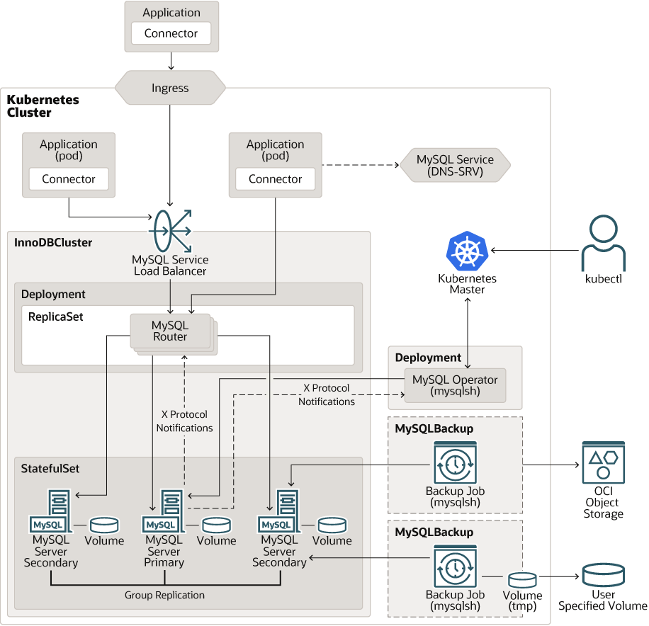

# 도커와 데이터베이스

한참 컨테이너를 공부를 했을 당시 도커의 주 목적이 빠른 배포/개발 환경을 구성하는 것이기 때문에 영속성을 가진 데이터베이스에는 적합하지 않았다고 알고 있다.
이에 대한 문제점으로 DB 데이터 손실을 언급한다. 그런데 도커를 생각해보면 volume 기능이 존재한다. 즉, 데이터를 영속적으로 보관할 수 있다는 것이다.
[현구막 기술 블로그](https://hyeon9mak.github.io/why-does-not-run-database-on-docker/)에서 보면 이론적으로는 도커를 사용해도 되었으나, 서비스 운영 측면에서는 도커라는 기술이 불안정해 쓰이지 않는다고 언급되어 있다.

# 쿠버네티스에서는요?

그런데 저건 도커에 한정된 이야기인 것 같다. 쿠버네티스의 특징을 잘 살펴보면 상태를 사전에 정의하고, 정의된 상태로 운영된다. 운영 측면에서 편리해 보이고, 안전성이 문제라고 한다면 다중화를 하면 된다.
[이정훈님의 medium - 실제로 본 DB on Kubernetes 효과](https://jerryljh.medium.com/%EC%8B%A4%EC%82%AC%EB%A1%80%EB%A1%9C-%EB%B3%B8-db-on-kubernetes-%ED%9A%A8%EA%B3%BC-eaed8e4e5811)에서 언급했다싶이 일부 성능 향상도 보이기도 했다고 한다.

# TodoPoint에서는 어떻게 구성하지?

StatefulSet을 사용하자가 결론이다. StatefulSet은 상태 정보를 구성할때 주로 사용된다.
아래의 블로그처럼 CronJob을 활용해서 백업을 구성하도록 설계해야 겠다는 생각이 들었다.

# Reference

- https://nangman14.tistory.com/79
