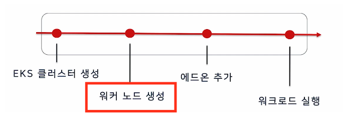

## EKS
Amazon Web Services(AWS)에 Kubernetes 컨트롤 플레인을 설치, 운영 및 유지 관리할 필요가 없는 관리형 서비스이다[^1].

## ECS vs EKS
- 둘 다  컨테이너 오케스트레이션이라는 점에서 공통점을 가짐
- ECS는 AWS가 만든 자체적인 오케스트레이션 구조로 K8S 구조와 완전 다름 
- K8S는 오픈소스가 크게 활성화되어 있고, 다양한 플러그를 사용할 수 있음 
- ECS는 오픈소스가 크게 활성화되어 있지 않음. 
- Auto-scaling 측면에서 EKS는 수동 및 자동 배포가 가능하지만 ECS는 수동으로만 가능하다. 
- 오류 수정하는데 ECS는 전문가가 필요함 

📌 자세한 사항은 [물통꿀꿀이님의 블로그, [AWS] ECS vs Kubernetes](https://timewizhan.tistory.com/entry/AWS-ECS-vs-Kubernetes)를 참고하길 바람.


EKS가 무조건 정답은 아니다. 프로젝트에 따라서는 ECS가 더 적합한 선택지일 수 있다. 
- [ECS 적용 사례 - 밍글](https://velog.io/@tanggu01/%EB%B0%8D%EA%B8%80-ECS-vs-EKS-EC2-vs-Fargate-%EB%B0%B0%ED%8F%AC-%EC%84%9C%EB%B9%84%EC%8A%A4-%EB%B9%84%EA%B5%90%ED%95%B4%EB%B3%B4%EA%B8%B0)


### 왜 EKS 설치는 어려운가?
우리가 알고 있는 쿠버네티스 구조와 달리 쿠버네티스는 일부 도구만 제공하고, 나머지는 별도의 설치가 필요하다. 이런 이유로 버전 관리가 어려워지기도 한다. 
- 쿠버네티스 제공 : kube-proxy, kubelet


[CNCF Graduated Project](https://www.cncf.io/projects/)를 보면 etcd, coreDNS 등을 볼 수 있다.


## EKS 구조

앞서 말했듯이 직접 구축하게 되면, 관리해야 하는 요소들이 많다. 이러한 어려움을 덜어내고자 EKS를 사용할 수 있다. EKS는 관리형 서비스로서 Control Plane를 직접 구성하지 않고 K8S를 사용할 수 있다. 

_출처 - https://kubernetes.io/docs/concepts/architecture/_

## EKS 특징 
- EKS CNI를 활용하여 VPC 네트워크 상에서 파드간 통신 가능 
- IAM을 활용하여 권한 설정 가능 
- AWS가 가용 영역별 API Server ,etcd 배포하여 고가용성 보장 
- eksctl를 활용하여 워커노드를 custom할 수 있음.

📌 자세한 사항은 [Jaden Park님의 블로그, Amazon EKS 란?](https://nearhome.tistory.com/128)를 참고하길 바란다. 

## AWS Side Workflow

_출처- https://nearhome.tistory.com/128_

- 쿠버네티스의 api 서버를 각 가용영역에 배포
- api 데이터, 쿠버네티스의 상태 데이터를 확인하기 위해 etcd를 같이 배포
- 쿠버네티스에서 오는 call 에 대한 IAM 구성
- 쿠버네티스 마스터 노드의 오토스케일링 설정
- 클러스터가 안정적으로 구현하도록 여기에 연결할 수 있는 로드밸런서를 구성

## Reference 
- [초보자를 위한 EKS 맛 보기](https://devocean.sk.com/blog/techBoardDetail.do?ID=163578)
- [ECS vs Kubernetes](https://timewizhan.tistory.com/entry/AWS-ECS-vs-Kubernetes)

[^1]:https://docs.aws.amazon.com/ko_kr/eks/latest/userguide/what-is-eks.html